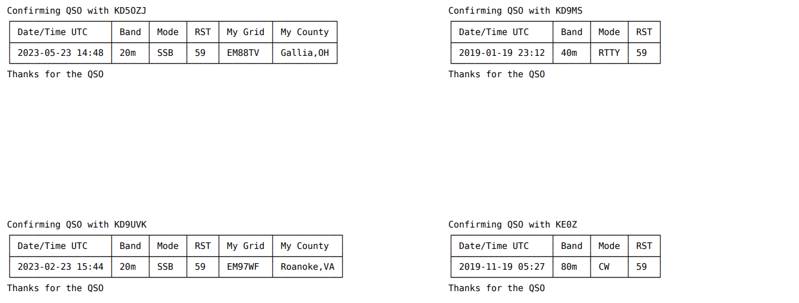

# Cloudlog Labels
Originally forked from magicbug/cloudlog-labels repo where it was designed around SAT QSO's.  I needed a label generator for mobile QSO's made for helping people who are hunting counties, I wanted to add in the ability to have multiple contacts per label and identify the gridsquare and County that I was operating from.  

I also wanted a nicer looking table on there so I learned a lot about unicode characters and fonts.  And that the PDF library that magicbug was using didn't support unicode characters so I had to switch it up to to tfpdf.

**generatelabels.php** - Leaves off My Grid/My County IF the county that I'm operating from is the same as one specified in a variable at the top.  (I moved but stayed in the same County but Identify them with different station locations so I couldn't use the Station ID to identify home)

**generatelabels-noalternate.php** - Same as above but all QSO's use My Grid/My County as well and it doesn't use that variable.

